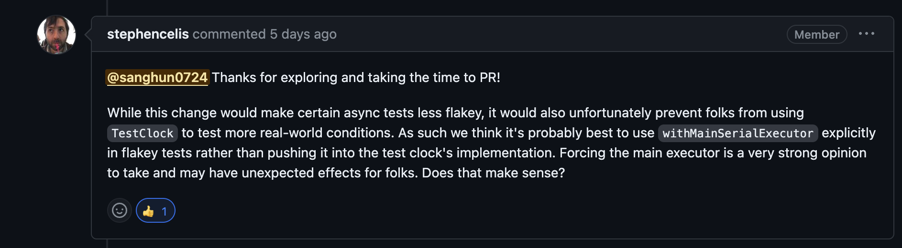
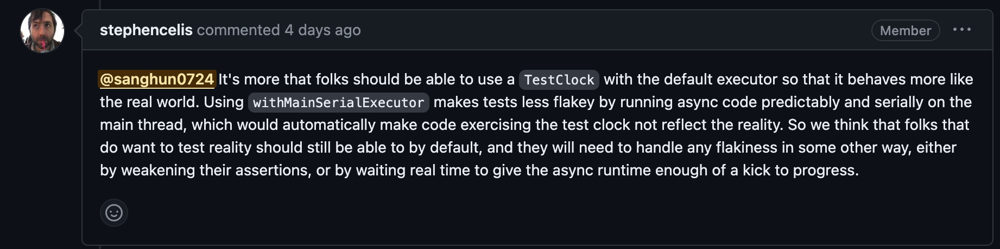

 

최근 내 iTime프로젝트에서 쓰고있던  swift-clocks 라이브러리의 Testclock을 사용한 clock unit test들이 random하게 터지는 일이 발생을 했다. 
원인을 찾아보니 TestClock에서 제공하는 advance(to:) 함수가 flakey한것이 원인이었다.  
 당시 내 생각은 Test에서 쓰이는 Clock의 인터페이스가 deterministic하지 못한건 잘못 되었다 생각하고 swift-concurrency-extra의 `withMainSerialExecutor` 함수를 사용해, TestClock의 advance(to:)  구현부를 감싸 Test시에 동작을 좀 더 deterministically 하게 바꾸어 PR을 올렸다.  

    

그러다 몇시간 만에 바로 poinfreeco 메인테이너인 [**stephencelis**](https://github.com/stephencelis) 에게서 답변이 달렸다. (기본적으로 PR 피드백이 굉장히 빠르신거 같다**👍**)

 
 
  

  
 
 

요약:

-   너의 코드가 Test를 less flakey하게 만드는건 맞다.

- 하지만, 실제 환경을 테스트하려는 사용자들이 TestClock을 사용하는 것을 방해 또는 예상치못한 effect를 발생시킬수 있다.

  
 

Test의 Flakiness에만 신경을 쓰고 있던터라, Test의 실제 환경 반영 여부는 잘 고려하지 못했었다. 또한 executor를 바꾸게 되면 기존 사용자들이 영향을 받을 수 있다는 점도 간과하였다.

그럼에도 불구하고, less flakey한 코드를 내버려두는것에 의구심이 남아 좀 더 디테일한 설명요청과 함께 질문을 드렸더니 흔쾌히 정성스런 답변을 주셨다.

 
 

 
 

요약:

-   사용자들은 default executor와 함께 TestClock을 사용하여 실제 환경과 유사하게 동작하도록 해야 한다.
-   withMainSerialExecutor를 사용하면 비동기 코드가 메인 스레드에서 예측 가능하게 연속적으로 실행되어 TestClock을 사용하는 코드가 현실과 다르게 동작하게 된다. 
-   따라 실제 환경을 테스트하려는 사용자들은 여전히 기본 설정에서 가능해야 하며, flakey한 부분은 다른 방법으로 각자 handling 되어야 하는게 적절하다.

  
  
 
즉, 애초에 이 라이브러리에서 TestClock이 설계 될때, 우선적으로 고려했던 것은 “Clock이라는 도메인의 실제환경을 반영하는 TestClock”인 것이다. 
그렇기에 내가 수정한 PR 코드의 변경으로 설계자가 의도한 “실제 환경 반영” 이라는 의도를 비틀 수 있는 것이다.
 따라서 이 PR이 반영 되려면, TestClock이 실제 환경을 반영하는 특징을 깨뜨리지 않고 기존 사용자들에게 의도되지 않는 영향을 주지 않으며 기존 개선하고자 했던 부분인  테스트 시의 less flakey한 ` advance(to:)` 구현체를 구현하면 된다.

 
 

근데 현재 처럼, **Less Flakiness vs Real-world Conditions을 비교해보아야 하는 상황이면 어떻게 해야할까?**

  

비교에 앞서, 둘의 정의부터 살펴보자.

  

**Less Flakiness:**

-   테스트의 덜 취약성은 일관된 결과를 가져오는 것을 의미. 이는 동일한 테스트를 여러 번 실행할 때 결과가 안정적이고 일관된지 여부를 나타냄.
-   테스트가 자주 실패하면, 실제로 문제가 발생하지 않았더라도 팀이 이를 무시할 수 있는 유혹에 빠질 수 있다.

  
 
 **Real-world Conditions:**

-   테스트가 실제 조건에서 어떻게 동작하는지 확인하는 것은 애플리케이션이 실제 사용 환경에서 어떻게 동작할지에 대한 자신감을 제공.
-   현실적인 조건에서 테스트를 실행하면 미처 고려하지 못한 환경에서 발생할 수 있는 문제를 미리 감지할 수 있다.

  

두 측면은 프로젝트의 성격에 따라 어떤 측면이 더 중요한지 나뉘게 된다. 만약, 프로젝트가 안정성과 신뢰성을 중시한다면 `Less Flakiness`가 중요할 수 있다.

반면에 실제 사용 환경에서 발생하는 다양한 조건을 반영해야 하는 경우 `Real-world Conditions`이 중요할 수 있다.

 
 

#### 결론

-   정답은 없다. “ Flakiness한 테스트? 잘못된거 아니야? “ 라고 바로 도달하기 보다는 한발자국 떨어져 관점을 바꾼 후 문제를 다각도로 관찰 해보도록 해보자.
-   라이브러리의  코드를  변경  시  기존  사용자들을에게  어떤  영향을  미치는지  늘  고려하도록  하자. 

 
 
 
Ref:   
[https://github.com/pointfreeco/swift-clocks/pull/27](https://github.com/pointfreeco/swift-clocks/pull/27)  
